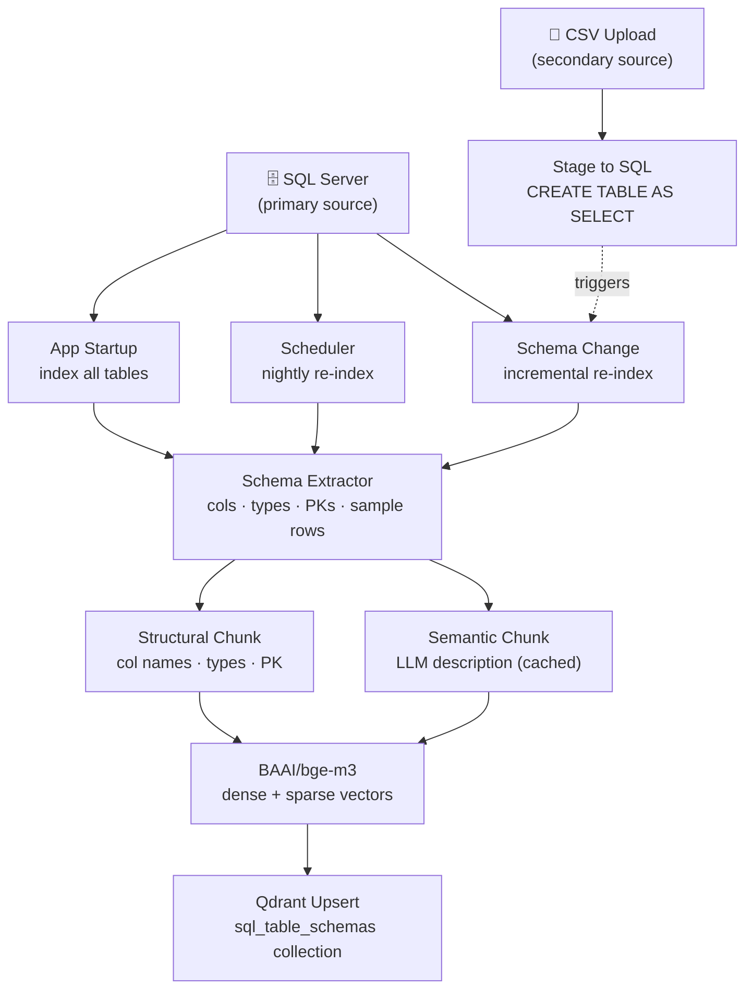
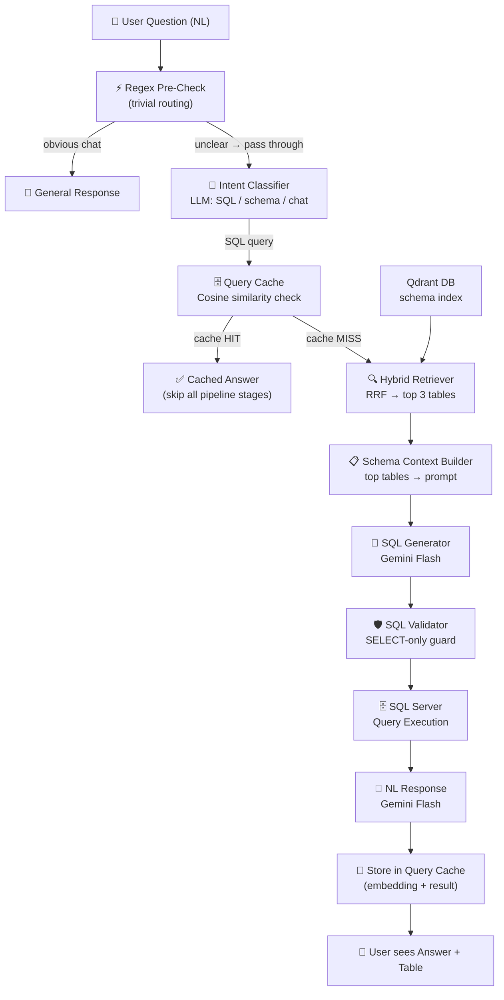

# Enterprise AI SQL Analytics Assistant
## Revised Architecture & Workflow — Production-Ready Blueprint

---

> [!IMPORTANT]
> This is the revised document incorporating all four architectural gaps:
> LLM description caching · Query cache layer · Regex pre-triage · CSV upload ingestion path.

---

## Dual Data Source Architecture

The system supports two data sources. Both converge at the same Schema Extractor.

| Source | Type | How Indexed |
|--------|------|-------------|
| **SQL Server** | Primary | App startup · Nightly scheduler · Incremental on schema change |
| **CSV Upload** | Secondary | On-demand — staged to SQL via `CREATE TABLE AS SELECT`, then indexed immediately |

---

## Phase 1 — Offline Indexing Pipeline



---

### Step 1.1 — Three Indexing Triggers

**Trigger A — App Startup (Full Index)**
Runs once when the Streamlit app boots. Checks if Qdrant collection already has points. If yes, skips. If no, builds full index.

```python
# indexing/index_manager.py
def run_startup_index():
    client = QdrantClient("localhost", port=6333)
    collection_info = client.get_collection("sql_table_schemas")
    if collection_info.points_count == 0:
        build_full_index()
    else:
        print(f"Index already populated. {collection_info.points_count} chunks found. Skipping.")
```

**Trigger B — Nightly Scheduler (Full Re-Index)**
Runs via a background thread or APScheduler. Drops and rebuilds the Qdrant collection at midnight.

```python
from apscheduler.schedulers.background import BackgroundScheduler

scheduler = BackgroundScheduler()
scheduler.add_job(build_full_index, "cron", hour=0, minute=0)
scheduler.start()
```

**Trigger C — Incremental Re-Index (Schema Change or CSV Upload)**
Runs immediately when a new table is created or a CSV is uploaded. Only re-indexes the affected table, not all 100.

```python
def incremental_reindex(table_name: str):
    """Called after CSV upload or ALTER TABLE detection."""
    # Delete old chunks for this table from Qdrant
    client.delete(
        collection_name="sql_table_schemas",
        points_selector=Filter(
            must=[FieldCondition(key="table_name", match=MatchValue(value=table_name))]
        )
    )
    # Re-extract, re-chunk, re-embed, re-upsert
    table_meta = extract_single_table(table_name)
    chunks = build_table_chunks(table_meta)
    upload_to_qdrant(chunks)
    print(f"Incrementally re-indexed: {table_name}")
```

---

### Step 1.2 — CSV Upload Ingestion Path

This is the critical path that was missing. When a user uploads a CSV file, the system does not just upload the data — it also immediately indexes the new table into Qdrant.

```python
# database/csv_uploader.py (extended)
def upload_csv_and_index(file_path: str, table_name: str):

    # Step 1: Parse CSV
    df, err = process_csv(file_path)
    if err:
        return False, err

    # Step 2: Stage to SQL Server (CREATE TABLE AS SELECT pattern)
    success, msg = upload_df_to_sql(df, table_name, if_exists="replace")
    if not success:
        return False, msg

    # Step 3: Immediately trigger incremental Qdrant re-index
    #         This makes the new table searchable in the chat within seconds
    from indexing.index_manager import incremental_reindex
    incremental_reindex(table_name)

    # Step 4: Bust schema metadata cache so existing pipeline sees new table
    from database.schema_manager import fetch_database_metadata
    fetch_database_metadata(force_refresh=True)

    return True, f"Uploaded and indexed '{table_name}' — ready to query!"
```

---

### Step 1.3 — Hybrid Chunking with LLM Description Caching

> [!IMPORTANT]
> **Caching is mandatory.** Without it, re-indexing 100 tables after a nightly refresh triggers 100 LLM API calls, inflating cost and latency. With caching, only new or changed tables trigger an LLM call.

**How Caching Works:**
The LLM-generated semantic description is stored in a local JSON file (`indexing/description_cache.json`). The key is a hash of the table's structural content (table name + column names + types). If the hash matches, the cached description is reused. If not (schema changed), a fresh LLM call is made.

```python
# indexing/semantic_description.py
import hashlib, json, os

CACHE_FILE = "indexing/description_cache.json"

def _compute_table_hash(table_meta: dict) -> str:
    signature = f"{table_meta['table_name']}:" + ",".join(
        f"{c['name']}:{c['type']}" for c in table_meta["columns"]
    )
    return hashlib.sha256(signature.encode()).hexdigest()

def get_semantic_description(table_meta: dict, llm_client) -> str:
    """Returns cached description or generates a fresh one via LLM."""
    cache = json.load(open(CACHE_FILE)) if os.path.exists(CACHE_FILE) else {}
    table_hash = _compute_table_hash(table_meta)

    if table_hash in cache:
        return cache[table_hash]   # Cache HIT — zero LLM calls

    # Cache MISS — call LLM once for this table
    prompt = f"""
    You are a database documentation expert.
    Write a 3-sentence natural language description of this database table.
    Include what business questions it can answer and what kind of data it holds.
    Focus on business meaning, not technical structure.

    Table: {table_meta['table_name']}
    Columns: {[c['name'] for c in table_meta['columns']]}
    Sample values: {table_meta.get('sample_values', {})}

    Description:
    """
    description = llm_client.generate(prompt)

    # Persist to cache
    cache[table_hash] = description
    with open(CACHE_FILE, "w") as f:
        json.dump(cache, f, indent=2)

    return description
```

**Two chunk types per table (unchanged from original):**

```python
# Structural Chunk — exact column matching
structural_text = f"""
Table: {table_name}
Columns: {', '.join(f"{c['name']} ({c['type']})" for c in columns)}
Primary Keys: {', '.join(primary_keys)}
Row Count: {row_count}
"""

# Semantic Chunk — concept matching (from cache or LLM)
semantic_text = get_semantic_description(table_meta, llm_client)
```

---

### Step 1.4 — Embedding with BAAI/bge-m3

```python
from FlagEmbedding import BGEM3FlagModel

model = BGEM3FlagModel("BAAI/bge-m3", use_fp16=True)

def embed_chunk(text: str) -> dict:
    output = model.encode(
        [text],
        return_dense=True,
        return_sparse=True,
        return_colbert_vecs=False
    )
    return {
        "dense":  output["dense_vecs"][0].tolist(),   # 1024-dim float list
        "sparse": output["lexical_weights"][0]        # dict of {token_id: weight}
    }
```

---

### Step 1.5 — Qdrant Upsert

```python
from qdrant_client.models import PointStruct, SparseVector

def upload_to_qdrant(chunks: list):
    for chunk in chunks:
        vectors = embed_chunk(chunk.text)

        client.upsert(
            collection_name="sql_table_schemas",
            points=[
                PointStruct(
                    id=str(uuid4()),
                    vector={
                        "dense":  vectors["dense"],
                        "sparse": SparseVector(
                            indices=list(vectors["sparse"].keys()),
                            values=list(vectors["sparse"].values())
                        )
                    },
                    payload={
                        "table_name":  chunk.metadata["table_name"],
                        "chunk_type":  chunk.metadata["chunk_type"],
                        "text":        chunk.text,
                        "columns":     chunk.metadata["columns"]
                    }
                )
            ]
        )
```

---

## Phase 2 — Online Query Pipeline



---

### Step 2.1 — Regex Pre-Check (Before LLM Triage)

> [!TIP]
> This eliminates the LLM call entirely for ~40% of messages (greetings, "thanks", "what tables do you have?" etc.), saving about 300ms per trivial interaction.

```python
# retrieval/query_router.py
import re

# Patterns that are DEFINITELY general chat — no LLM needed
CHAT_PATTERNS = [
    r"^(hi|hello|hey|howdy|good\s(morning|evening|afternoon))[\s!.?]*$",
    r"^(thanks?|thank you|thx|ok|okay|got it|cool|great|nice)[\s!.?]*$",
    r"^(bye|goodbye|see you|exit|quit)[\s!.?]*$",
]

# Patterns that are DEFINITELY SQL queries — skip LLM intent check
SQL_PATTERNS = [
    r"\b(show|list|find|get|fetch|count|sum|average|how many|what is)\b.*(table|record|row|ticket|employee|order|customer|invoice)",
    r"\b(top|highest|lowest|most|least)\b.*\b(by|in|from)\b",
]

def pre_check_intent(user_query: str) -> str | None:
    """
    Returns 'CHAT', 'SQL_QUERY', or None (meaning: defer to LLM classifier).
    """
    q = user_query.strip().lower()

    for pattern in CHAT_PATTERNS:
        if re.match(pattern, q, re.IGNORECASE):
            return "CHAT"

    for pattern in SQL_PATTERNS:
        if re.search(pattern, q, re.IGNORECASE):
            return "SQL_QUERY"

    return None   # Ambiguous — send to LLM intent classifier
```

**Full Router Logic:**

```python
def route_query(user_query: str, llm_client) -> str:
    # Step 1: Free regex check (0ms)
    intent = pre_check_intent(user_query)

    if intent:
        return intent   # No LLM call needed

    # Step 2: LLM call only for ambiguous messages (~300ms)
    return llm_classify_intent(user_query, llm_client)
```

---

### Step 2.2 — Query Cache Layer (Avoid Redundant Execution)

> [!NOTE]
> Users in a business MIS tool repeat very similar questions. "Show tickets for Billy George" and "Get all tickets of Billy George" should return the same cached result without hitting SQL Server or calling the LLM again.

**How it works:**
1. Embed the user's question using BAAI/bge-m3.
2. Search Qdrant's **separate** `query_cache` collection for any past query with cosine similarity > 0.92.
3. If found (cache HIT), return the cached NL response and data directly.
4. If not found (cache MISS), run the full pipeline, then store the result in the cache.

```python
# retrieval/query_cache.py

CACHE_COLLECTION = "query_cache"
SIMILARITY_THRESHOLD = 0.92

def check_query_cache(user_query: str) -> dict | None:
    query_vector = embed_chunk(user_query)["dense"]

    results = client.search(
        collection_name=CACHE_COLLECTION,
        query_vector=("dense", query_vector),
        limit=1,
        score_threshold=SIMILARITY_THRESHOLD
    )

    if results:
        payload = results[0].payload
        return {
            "cache_hit": True,
            "nl_response": payload["nl_response"],
            "rows":        payload["rows"],
            "columns":     payload["columns"],
            "original_query": payload["original_query"]
        }
    return None


def store_in_query_cache(user_query: str, nl_response: str, query_result: dict):
    vector = embed_chunk(user_query)["dense"]

    client.upsert(
        collection_name=CACHE_COLLECTION,
        points=[
            PointStruct(
                id=str(uuid4()),
                vector={"dense": vector},
                payload={
                    "original_query": user_query,
                    "nl_response":    nl_response,
                    "rows":           query_result["rows"][:50],
                    "columns":        query_result["columns"]
                }
            )
        ]
    )
```

---

### Step 2.3 — Hybrid Table Retriever (Unchanged)

```python
from qdrant_client.models import Prefetch, FusionQuery, Fusion

def retrieve_relevant_tables(user_query: str, top_k: int = 3) -> list[str]:
    dense  = embed_chunk(user_query)["dense"]
    sparse = embed_chunk(user_query)["sparse"]   # dict {token_id: weight}

    results = client.query_points(
        collection_name="sql_table_schemas",
        prefetch=[
            Prefetch(query=dense,   using="dense",  limit=20),
            Prefetch(query=SparseVector(
                indices=list(sparse.keys()),
                values=list(sparse.values())
            ), using="sparse", limit=20),
        ],
        query=FusionQuery(fusion=Fusion.RRF),
        limit=top_k * 2
    )

    seen, tables = set(), []
    for r in results.points:
        t = r.payload["table_name"]
        if t not in seen:
            seen.add(t)
            tables.append(t)
        if len(tables) == top_k:
            break

    return tables
```

---

### Steps 2.4–2.6 — Schema Context, SQL Generator, Validator, Execution, NL Response

These are **unchanged** from your existing system (`schema_context.py`, `query_ai.py`, `query_executor.py`, `response_generator.py`). The only integration point is in `process_query.py`:

```python
# workflow/process_query.py (updated integration points)
def process_user_query(user_query: str) -> dict:

    # NEW: Regex pre-check
    intent = pre_check_intent(user_query)

    if intent == "CHAT":
        return {"success": True, "nl_response": "Hi! Ask me anything about your data."}

    # NEW: Query cache check
    cached = check_query_cache(user_query)
    if cached:
        return {"success": True, "cache_hit": True, **cached}

    # NEW: Hybrid Qdrant retrieval (replaces old table_analyzer.py)
    focus_tables = retrieve_relevant_tables(user_query)

    # UNCHANGED: all remaining stages
    schema_context = generate_schema_context(user_query, focus_tables=focus_tables)
    sql_result     = generate_sql_query(user_query, schema_context)
    exec_result    = execute_sql_query(sql_result["sql_query"])
    nl_response    = generate_natural_language_response(user_query, sql_result["sql_query"], exec_result["result"])

    # NEW: Store result in query cache
    store_in_query_cache(user_query, nl_response["response_text"], exec_result["result"])

    return {
        "success":     True,
        "cache_hit":   False,
        "generated_sql": sql_result["sql_query"],
        "query_result":  exec_result["result"],
        "nl_response":   nl_response["response_text"]
    }
```

---

## Complete Directory Structure

```
ai-sql-assistant/
│
├── app.py                              # Streamlit entry point
│
├── indexing/                           # Offline indexing pipeline
│   ├── index_manager.py                # Startup / scheduler / incremental triggers
│   ├── schema_extractor.py             # Pull schemas from SQL Server
│   ├── chunk_builder.py                # Build structural + semantic chunks
│   ├── semantic_description.py         # LLM description generator WITH cache
│   ├── description_cache.json          # Cached LLM descriptions (auto-managed)
│   ├── embedder.py                     # BAAI/bge-m3 wrapper
│   └── qdrant_uploader.py              # Upsert to Qdrant
│
├── retrieval/                          # Online query pipeline
│   ├── query_router.py                 # Regex pre-check + LLM intent classifier
│   ├── table_retriever.py              # Hybrid Qdrant RRF search
│   └── query_cache.py                  # Query cache read/write via Qdrant
│
├── analysis/
│   └── schema_context.py               # UNCHANGED
│
├── llm/
│   ├── query_ai.py                     # UNCHANGED
│   └── response_generator.py           # UNCHANGED
│
├── workflow/
│   ├── process_query.py                # Updated integration points only
│   └── query_executor.py              # UNCHANGED
│
├── database/
│   ├── sql_server.py                   # UNCHANGED
│   ├── schema_manager.py               # UNCHANGED (uses st.cache_data)
│   └── csv_uploader.py                 # Extended with incremental_reindex call
│
├── pages/
│   ├── chat_page.py                    # UNCHANGED
│   └── upload_page.py                  # Updated to call new csv_uploader
│
└── .env
```

---

## Qdrant Collections Required

| Collection Name | Purpose | Vector Types |
|----------------|---------|-------------|
| `sql_table_schemas` | Table schema index — 2 chunks per table | Dense (1024) + Sparse (BM25) |
| `query_cache` | Past query results — cosine hit bypass | Dense only (1024) |

---

## Complete Tech Stack

| Layer | Tool | Notes |
|-------|------|-------|
| Frontend | Streamlit | Unchanged |
| Embedding | BAAI/bge-m3 (local, free) | Dense + Sparse in one model |
| Vector DB | Qdrant (Docker) | Two collections |
| Hybrid Search | Qdrant RRF Fusion | Dense + BM25 merged |
| Query Cache | Qdrant cosine sim | Threshold: 0.92 |
| Description Cache | Local JSON file | Hash-keyed by schema signature |
| Intent Router | Regex + Gemini Flash Lite | Regex first, LLM only if ambiguous |
| SQL Generator | Google Gemini Flash | Unchanged |
| NL Generator | Google Gemini Flash | Unchanged |
| Scheduler | APScheduler (background thread) | Nightly full re-index |
| DB Driver | SQLAlchemy + pyodbc | Unchanged |
| Data Processing | Pandas | Unchanged |

---

## Additional Dependencies

```
# New additions to requirements.txt
FlagEmbedding              # BAAI/bge-m3
qdrant-client[fastembed]   # Qdrant Python SDK
apscheduler                # Nightly re-index scheduler
```

---

## Build Order (Step-by-Step)

```
 Foundation
  1. Install Docker, run Qdrant container
  2. Install FlagEmbedding, test BAAI/bge-m3 locally
  3. Build schema_extractor.py (reuse schema_manager.py logic)
  4. Build chunk_builder.py + description_cache.py
  5. Build embedder.py + qdrant_uploader.py
  6. Run full index on your 100 tables. Verify chunks in Qdrant UI (localhost:6333)

 Query Pipeline
  7. Build table_retriever.py — test hybrid search
  8. Build query_router.py (regex + LLM triage)
  9. Build query_cache.py
  10. Update process_query.py with new integration points
  11. Update csv_uploader.py with incremental_reindex call

LATER NOT NOW --Polish
  12. Add APScheduler nightly re-index
  13. Add index_manager.py startup check
  14. End-to-end integration tests across 10+ diverse questions
  15. Deploy
```
