# 🛰️ API Flow & Integration Guide

This document explains the end-to-end flow of **API calls** within the **AI SQL Analytics Assistant**. It breaks down how the orchestration layer coordinates calls between the user UI, the **Groq LLM API**, the **Qdrant Vector Database**, and **Microsoft SQL Server**.

---

## 🗺️ High-Level Sequence Diagram

Below is the sequence of API calls and database queries executed for a typical user request:

```mermaid
sequenceDiagram
    autonumber
    actor User
    participant App as Streamlit UI
    participant Orchestrator as process_query.py
    participant Qdrant as Qdrant Vector DB
    participant Groq as Groq LLM API
    participant SQLServer as SQL Server Database

    User->>App: Submits question (e.g. "what is Mkt&Fin?")
    Note over App: Check Conversation History
    App->>Orchestrator: process_user_query(query, history)
    
    rect rgb(30, 41, 59)
        Note over Orchestrator, Groq: 1. Contextualize Query
        Orchestrator->>Groq: API call to rephrase based on history
        Groq-->>Orchestrator: Returns standalone query ("What is Mkt&Fin specialization?")
    end

    rect rgb(30, 59, 41)
        Note over Orchestrator, Qdrant: 2. Fast Retrieve or Hybrid Search
        Orchestrator->>Orchestrator: Run fast keyword match (0ms)
        alt Cache Miss
            Orchestrator->>Qdrant: Hybrid Search (Dense + Sparse)
            Qdrant-->>Orchestrator: Returns top relevant tables
        end
    end

    rect rgb(59, 30, 41)
        Note over Orchestrator, Groq: 3. SQL Query Generation
        Orchestrator->>Groq: Generate SQL API call (prompt + schema context)
        Groq-->>Orchestrator: Returns raw SQL
    end

    rect rgb(41, 59, 80)
        Note over Orchestrator, SQLServer: 4. Execute Query
        Orchestrator->>SQLServer: Run T-SQL query via SQLAlchemy
        SQLServer-->>Orchestrator: Returns row datasets
    end

    rect rgb(70, 70, 70)
        Note over Orchestrator, Groq: 5. Generate Business Insights
        Orchestrator->>Groq: API call to summarize data results
        Groq-->>Orchestrator: Returns human-friendly text
    end

    Orchestrator-->>App: Return success payload
    App->>User: Displays text & data tables
```



---

## ⚙️ API Configuration & Setup

All API communication relies on configuration keys defined in your `.env` file:

```env
# Groq LLM Configuration
GROQ_API_KEY=gsk_your_api_key_here
GROQ_MODEL=llama-3.1-8b-instant

# Vector Store (Qdrant) Configuration
QDRANT_HOST=localhost
QDRANT_PORT=6333
SCHEMA_COLLECTION=ai_sql_schema_index

# Relational Database (SQL Server) Configuration
DB_SERVER=localhost
DB_DATABASE=ai_sql_db
```

---

## 🔍 Detailed Walkthrough of API Calls

### 1. Rephrasing & Contextualization API
* **Endpoint:** `https://api.groq.com/openai/v1/chat/completions` (via SDK client)
* **Goal:** Convert conversational inputs (like *"what is that?"*) into self-contained search terms using context from recent turns.
* **Payload Structure:**
  ```python
  from llm.llm_client import generate_text

  prompt = f"""
  Conversation History:
  User: Which specialization has the best placements?
  Assistant: Mkt&Fin has the highest paid placements.

  Latest Follow-up Question: "what is Mkt&Fin ?"
  Standalone Question:"""

  standalone_query = generate_text(prompt)
  # Returns: "What is the Mkt&Fin specialization?"
  ```

---

### 2. Intent Routing & Classification
* **Endpoint:** `https://api.groq.com/openai/v1/chat/completions`
* **Goal:** Classify query intent into `CHAT`, `SCHEMA_INFO`, or `SQL_QUERY`.
* **Flow:** 
  1. Executes a fast regex scan (0ms).
  2. If ambiguous, makes an LLM routing API call:
     ```python
     intent = llm_classify_intent("What is the Mkt&Fin specialization?")
     # Returns: "SCHEMA_INFO"
     ```

---

### 3. Vector Database Retrieval (Qdrant)
* **Endpoint:** `POST /collections/{collection_name}/points/query`
* **Goal:** Retrieve schema chunks matching the semantic meaning of the user query.
* **Flow:**
  * If a fast keyword match is found in the local schema cache, this network call is **bypassed (0ms)**.
  * If a cache miss occurs, the system makes a hybrid dense + sparse query:
    ```python
    # Using python qdrant-client
    client.query_points(
        collection_name="ai_sql_schema_index",
        prefetch=[
            Prefetch(query=dense_vector, using="dense", limit=20),
            Prefetch(query=sparse_vector, using="sparse", limit=20)
        ],
        query=FusionQuery(fusion=Fusion.RRF)
    )
    ```

---

### 4. SQL Code Generation API
* **Endpoint:** `https://api.groq.com/openai/v1/chat/completions`
* **Goal:** Translate the user query + database schema structures into clean, executable SQL.
* **Payload Structure:**
  ```json
  {
    "model": "llama-3.1-8b-instant",
    "messages": [
      {
        "role": "system",
        "content": "You are a T-SQL expert. Generate ONLY SQL..."
      },
      {
        "role": "user",
        "content": "Database Schema: Table dbo.employees...\nQuery: Show top 3 highest paid employees"
      }
    ]
  }
  ```

---

### 5. Insight Synthesis & Natural Language API
* **Endpoint:** `https://api.groq.com/openai/v1/chat/completions`
* **Goal:** Transform raw table outputs/statistics into friendly business summaries.
* **Payload Structure:**
  ```json
  {
    "model": "llama-3.1-8b-instant",
    "messages": [
      {
        "role": "user",
        "content": "User question: 'Who has the highest salary?'\nSQL results: [{'employee_name': 'Alice', 'salary': 150000}]"
      }
    ]
  }
  ```

---

## 📊 Combined Prompt Structure & Token Budget

To maximize efficiency and minimize cost, the orchestration layer packages retrieved data and system instructions into highly optimized prompts. Here is how they are formatted and how many tokens they consume.

### 1. Anatomy of the SQL Generation Prompt (The "One Prompt" Package)
When generating SQL, the assistant combines **System Rules**, **Database Schema Metadata**, and the **User Question** into a single prompt payload:

```markdown
┌────────────────────────────────────────────────────────────────────────┐
│ SYSTEM INSTRUCTIONS:                                                   │
│ You are a T-SQL expert. Generate ONLY valid, clean SELECT queries.     │
│ Do not explain anything. Use TOP instead of LIMIT.                     │
├────────────────────────────────────────────────────────────────────────┤
│ DATABASE SCHEMA CONTEXT (Retrieved from Qdrant/Fast-cache):            │
│ Table: dbo.csv_employees                                               │
│ Columns:                                                               │
│   - employee_id (int, NOT NULL) [PK]                                   │
│   - employee_name (varchar(100), NULL)                                 │
│   - salary (decimal(18,2), NULL)                                       │
│ Sample Values:                                                         │
│   - salary: [85000.00, 120000.00, 64000.00]                            │
├────────────────────────────────────────────────────────────────────────┤
│ USER QUERY:                                                            │
│ "Who are the 3 highest paid employees?"                                │
└────────────────────────────────────────────────────────────────────────┘
```

---

### 2. Token Budget & API Request Estimation

Here is a simple breakdown of the token footprint and network API requests made under different conditions:

| Query Type / Scenario | API Requests to Groq | Avg. Input Tokens | Avg. Output Tokens | Total Time |
| :--- | :---: | :---: | :---: | :---: |
| **Scenario A: Semantic Cache Hit** | **0** | `0` | `0` | **< 5ms** |
| **Scenario B: Standalone Query (Keyword Match)** | **2** <br> *(1 SQL Gen + 1 NL Resp)* | `1,500` | `150` | **~500ms** |
| **Scenario C: Ambiguous Follow-Up (Full Pipeline)** | **3** <br> *(1 Context + 1 SQL Gen + 1 NL Resp)* | `2,500` | `200` | **~750ms** |

#### Why is this token usage so low?
1. **Incremental Context Only:** The system does not feed raw database tables to the LLM. It only passes **schema signatures** (column structures) and a few sample cell values.
2. **Aggregated Results:** Before passing query results back to the LLM for natural language response generation, the `result_enricher` summarizes large datasets into statistical profiles (counts, averages, sums), keeping response tokens small.

---

## 💡 Best Practices & Latency Optimization

> [!TIP]
> **Semantic Cache is Active**
> If a query is identical or semantically very close to a previously executed query, the system bypasses Groq and SQL Server entirely, serving the results from the Qdrant Cache collection `ai_sql_query_cache` in **< 5ms**.

> [!NOTE]
> **No Direct Internet Calls**
> Embedding generation (`BAAI/bge-m3`) runs 100% locally on your machine. Network latency is only incurred on the final Groq API completion requests, which typically take **200ms - 400ms**.
