# 🛰️ API Flow & Integration Guide

This document explains the end-to-end flow of **API calls** within the **AI SQL Analytics Assistant**. It breaks down how the orchestration layer coordinates calls between the user UI, the **mem0 Cloud API**, the **Groq LLM API**, the **Qdrant Vector Database**, and **Microsoft SQL Server**.

---

## 🗺️ High-Level Sequence Diagram

Below is the sequence of API calls and database queries executed for a typical user request:

```mermaid
sequenceDiagram
    autonumber
    actor User
    participant App as Streamlit UI
    participant Orchestrator as process_query.py
    participant mem0 as mem0 Cloud API
    participant Qdrant as Qdrant Vector DB
    participant Groq as Groq LLM API
    participant SQLServer as SQL Server Database

    User->>App: Submits question (e.g. "what is their salary?")
    App->>Orchestrator: process_user_query(query)
    
    rect rgb(30, 41, 59)
        Note over Orchestrator, mem0: 1. Contextualize Query (if follow-up)
        Orchestrator->>mem0: Fetch semantic facts for user
        mem0-->>Orchestrator: Returns history facts (e.g., "focusing on Employees table")
        Orchestrator->>Groq: API call to rephrase using facts
        Groq-->>Orchestrator: Returns standalone query ("what is the salary of employees?")
    end

    rect rgb(41, 59, 80)
        Note over Orchestrator, Qdrant: 2. Semantic Cache Check
        Orchestrator->>Qdrant: Check query_cache (similarity search)
        alt Cache HIT (similarity >= 0.92)
            Qdrant-->>Orchestrator: Returns cached NL response + records
            Orchestrator-->>App: Bypasses downstream APIs
        else Cache MISS
            Qdrant-->>Orchestrator: Returns miss
        end
    end

    alt Cache MISS
        rect rgb(30, 59, 41)
            Note over Orchestrator, Qdrant: 3. Schema Hybrid Retrieval
            Orchestrator->>Qdrant: Query sql_table_schemas (Dense + Sparse RRF)
            Qdrant-->>Orchestrator: Returns top 3 relevant table structures
        end

        rect rgb(59, 30, 41)
            Note over Orchestrator, Groq: 4. SQL Query Generation
            Orchestrator->>Groq: Generate SQL API call (schema context + query rules)
            Groq-->>Orchestrator: Returns T-SQL SELECT query
        end

        rect rgb(70, 41, 90)
            Note over Orchestrator, SQLServer: 5. Execute Query & Fallback
            Orchestrator->>SQLServer: Run T-SQL query via SQLAlchemy
            alt Query Execution Fails
                Orchestrator->>Groq: Initialize SQL Agent tool-calling loop
                Groq->>SQLServer: Inspect columns & run corrected query
                SQLServer-->>Groq: Return self-healed results
                Groq-->>Orchestrator: Return healed dataset
            else Success
                SQLServer-->>Orchestrator: Returns row datasets
            end
        end

        rect rgb(70, 70, 70)
            Note over Orchestrator, Groq: 6. Generate Business Insights
            Orchestrator->>Groq: API call to summarize Pandas enriched profile
            Groq-->>Orchestrator: Returns conversational response
        end

        rect rgb(90, 60, 30)
            Note over Orchestrator, mem0: 7. Memory & Cache Sync (Async)
            par Async Memory Store
                Orchestrator->>mem0: Asynchronously store new conversation facts
            and Async Cache Store
                Orchestrator->>Qdrant: Asynchronously insert result into query_cache
            end
        end
    end

    Orchestrator-->>App: Return success payload
    App->>User: Displays text & data tables
```



---

## ⚙️ API Configuration & Setup

All API communication relies on configuration keys defined in your `.env` file:

```env
# Groq LLM Configuration
GROQ_API_KEY=gsk_your_api_key_here
GROQ_MODEL=llama-3.1-8b-instant
GROQ_AGENT_MODEL=llama-3.3-70b-versatile

# Fallback LLM Providers
OPENAI_API_KEY=sk-proj-xxxx
OPENAI_MODEL=gpt-4o-mini
GEMINI_API_KEY=AIzaSyxxxx
GEMINI_MODEL=gemini-1.5-flash

# mem0 Conversational Memory Cloud API
MEM0_API_KEY=m0-xxxx
MEM0_USER_ID=default_user

# Vector Store (Qdrant) Configuration
QDRANT_HOST=localhost
QDRANT_PORT=6333
SCHEMA_COLLECTION=ai_sql_schema_index
QUERY_CACHE_COLLECTION=ai_sql_query_cache

# Relational Database (SQL Server) Configuration
SQL_SERVER=localhost\SQLEXPRESS
SQL_DATABASE=ai_sql_assistant
SQL_TRUSTED_CONNECTION=yes
```

---

## 🔍 Detailed Walkthrough of API Calls

### 1. Conversational Memory APIs (mem0 Cloud)
* **Fact Retrieval Endpoint:** `POST https://api.mem0.ai/v1/memories/search/`
* **Fact Storage Endpoint:** `POST https://api.mem0.ai/v1/memories/`
* **Goal:** Store long-term semantic context about users and retrieve facts to rephrase vague follow-up questions.
* **Payload Examples:**
  - **Retrieve Facts:**
    ```json
    {
      "query": "what is their salary?",
      "user_id": "user_abc123"
    }
    ```
  - **Store Facts:**
    ```json
    {
      "messages": [
        {"role": "user", "content": "Let's focus on employees earning over 80000."},
        {"role": "assistant", "content": "I will keep employee salaries above 80k in mind."}
      ],
      "user_id": "user_abc123"
    }
    ```

---

### 2. Rephrasing & Contextualization API
* **Endpoint:** `POST https://api.groq.com/openai/v1/chat/completions` (via SDK client)
* **Goal:** Convert conversational inputs (like *"what is that?"*) into self-contained search terms using context from recent turns and mem0 facts.
* **Payload Structure:**
  ```python
  from llm.llm_client import generate_text

  prompt = f"""
  Conversation History:
  User: Which specialization has the best placements?
  Assistant: Mkt&Fin has the highest paid placements.

  Retrieved Memory Facts:
  - User is interested in MBA specializations.

  Latest Follow-up Question: "what is Mkt&Fin ?"
  Standalone Question:"""

  standalone_query = generate_text(prompt)
  # Returns: "What is the Mkt&Fin specialization?"
  ```

---

### 3. Intent Routing & Classification
* **Endpoint:** `POST https://api.groq.com/openai/v1/chat/completions`
* **Goal:** Classify query intent into one of 9 routing categories: `CHAT`, `SQL_QUERY`, `SCHEMA_INFO`, `DESCRIBE`, `DATA_PREVIEW`, `SCHEMA_EXPLANATION`, `CONVERSATION_SUMMARY`, `TEMPORAL`, or `GENERAL_KNOWLEDGE`.
* **Flow:** 
  1. Executes a fast regex scan (0ms).
  2. If ambiguous, makes an LLM routing API call:
     ```python
     intent = llm_classify_intent("What is the Mkt&Fin specialization?")
     # Returns: "SCHEMA_INFO"
     ```

---

### 4. Vector Database Retrieval (Qdrant)
* **Endpoint:** `POST /collections/{collection_name}/points/query`
* **Goal:** Retrieve schema chunks matching the semantic meaning of the user query.
* **Flow:**
  * Checks `query_cache` first.
  * If a cache miss occurs, the system makes a hybrid dense + sparse query against `sql_table_schemas` (`SCHEMA_COLLECTION`):
    ```python
    # Using python qdrant-client
    client.query_points(
        collection_name="ai_sql_schema_index",
        prefetch=[
            Prefetch(query=dense_vector, using="dense", limit=20),
            Prefetch(query=sparse_vector, using="sparse", limit=20)
        ],
        query=FusionQuery(fusion=Fusion.RRF)
    )
    ```

---

### 4. SQL Code Generation API
* **Endpoint:** `https://api.groq.com/openai/v1/chat/completions`
* **Goal:** Translate the user query + database schema structures into clean, executable SQL.
* **Payload Structure:**
  ```json
  {
    "model": "llama-3.1-8b-instant",
    "messages": [
      {
        "role": "system",
        "content": "You are a T-SQL expert. Generate ONLY SQL..."
      },
      {
        "role": "user",
        "content": "Database Schema: Table dbo.employees...\nQuery: Show top 3 highest paid employees"
      }
    ]
  }
  ```

---

### 5. Insight Synthesis & Natural Language API
* **Endpoint:** `https://api.groq.com/openai/v1/chat/completions`
* **Goal:** Transform raw table outputs/statistics into friendly business summaries.
* **Payload Structure:**
  ```json
  {
    "model": "llama-3.1-8b-instant",
    "messages": [
      {
        "role": "user",
        "content": "User question: 'Who has the highest salary?'\nSQL results: [{'employee_name': 'Alice', 'salary': 150000}]"
      }
    ]
  }
  ```

---

## 📊 Combined Prompt Structure & Token Budget

To maximize efficiency and minimize cost, the orchestration layer packages retrieved data and system instructions into highly optimized prompts. Here is how they are formatted and how many tokens they consume.

### 1. Anatomy of the SQL Generation Prompt (The "One Prompt" Package)
When generating SQL, the assistant combines **System Rules**, **Database Schema Metadata**, and the **User Question** into a single prompt payload:

```markdown
┌────────────────────────────────────────────────────────────────────────┐
│ SYSTEM INSTRUCTIONS:                                                   │
│ You are a T-SQL expert. Generate ONLY valid, clean SELECT queries.     │
│ Do not explain anything. Use TOP instead of LIMIT.                     │
├────────────────────────────────────────────────────────────────────────┤
│ DATABASE SCHEMA CONTEXT (Retrieved from Qdrant/Fast-cache):            │
│ Table: dbo.csv_employees                                               │
│ Columns:                                                               │
│   - employee_id (int, NOT NULL) [PK]                                   │
│   - employee_name (varchar(100), NULL)                                 │
│   - salary (decimal(18,2), NULL)                                       │
│ Sample Values:                                                         │
│   - salary: [85000.00, 120000.00, 64000.00]                            │
├────────────────────────────────────────────────────────────────────────┤
│ USER QUERY:                                                            │
│ "Who are the 3 highest paid employees?"                                │
└────────────────────────────────────────────────────────────────────────┘
```

---

### 2. Token Budget & API Request Estimation

Here is a simple breakdown of the token footprint and network API requests made under different conditions:

| Query Type / Scenario | API Requests to Groq | Avg. Input Tokens | Avg. Output Tokens | Total Time |
| :--- | :---: | :---: | :---: | :---: |
| **Scenario A: Semantic Cache Hit** | **0** | `0` | `0` | **< 5ms** |
| **Scenario B: Standalone Query (Keyword Match)** | **2** <br> *(1 SQL Gen + 1 NL Resp)* | `1,500` | `150` | **~500ms** |
| **Scenario C: Ambiguous Follow-Up (Full Pipeline)** | **3** <br> *(1 Context + 1 SQL Gen + 1 NL Resp)* | `2,500` | `200` | **~750ms** |

#### Why is this token usage so low?
1. **Incremental Context Only:** The system does not feed raw database tables to the LLM. It only passes **schema signatures** (column structures) and a few sample cell values.
2. **Aggregated Results:** Before passing query results back to the LLM for natural language response generation, the `result_enricher` summarizes large datasets into statistical profiles (counts, averages, sums), keeping response tokens small.

---

### 3. API Token & Payload Enrichment (`api_tokens_enrichment`)

To prevent context window bloating, keep Groq API pricing low, and guarantee response completion times under **300ms**, the system implements **API Token Enrichment**:

```
[Raw SQL Server Result] (10,000 rows / ~5 MB)
          │
          ▼
[pandas Result Enricher] (Computes sums, averages, frequencies + 5-row sample)
          │
          ▼
[Enriched Token Payload] (<2 KB metadata summary) ───> [Groq completions API]
```

#### How it works:
* **Raw Data Suppression**: Large database result sets are intercepted at the database driver layer. They are never transmitted over the internet to Groq.
* **Statistical Profiling**: A pandas-based pipeline computes numeric column metrics (mean, min, max, sum) and categorical unique/frequency value tables.
* **Context-Aware Metadata Flags**: Properties like `is_truncated` (whether a preview limit was active), `is_count_query` (whether the result is a scalar aggregate), and `table_total_rows` (the database-wide total row count) are added to the prompt.
* **Token Savings**:
  - **Raw Data Payload**: `~500 KB to 5 MB` (potentially hundreds of thousands of tokens).
  - **Enriched Profile Payload**: `~1 KB to 2 KB` (under 500 tokens).
  - **Result**: A **99.8% reduction** in input token volume, avoiding Groq rate limits while maintaining 100% analytical correctness.

---

## 💡 Best Practices & Latency Optimization

> [!TIP]
> **Semantic Cache is Active**
> If a query is identical or semantically very close to a previously executed query, the system bypasses Groq and SQL Server entirely, serving the results from the Qdrant Cache collection `ai_sql_query_cache` in **< 5ms**.

> [!NOTE]
> **No Direct Internet Calls**
> Embedding generation (`BAAI/bge-m3`) runs 100% locally on your machine. Network latency is only incurred on the final Groq API completion requests, which typically take **200ms - 400ms**.

> [!IMPORTANT]
> **Autonomous LangChain Agent Fallback**
> If a generated SQL query fails to execute on SQL Server (e.g. because of a schema signature update, column drift, or complex query structure), the system automatically triggers a **self-healing fallback**:
> 1. It initiates the **LangChain SQL Agent** (`llm/langchain_agent.py`) using `ChatGroq` and `SQLDatabase`.
> 2. The agent uses native tool-calling (`agent_type="tool-calling"`) to bind database tools directly to `ChatGroq`, executing a multi-step loop to inspect columns, correct the SQL query, and recover the dataset autonomously.
> 3. This ensures the user receives a valid response even when traditional deterministic generation fails.
