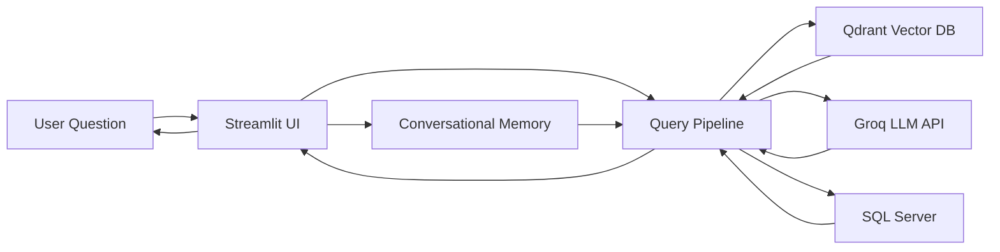
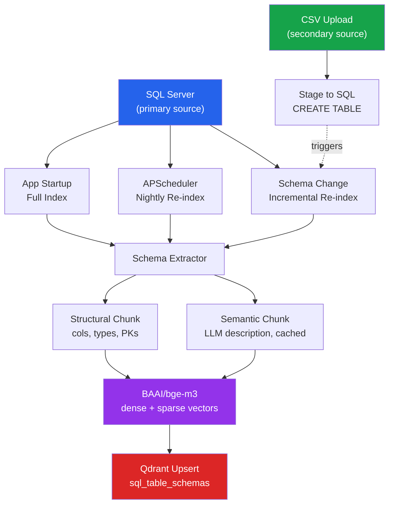
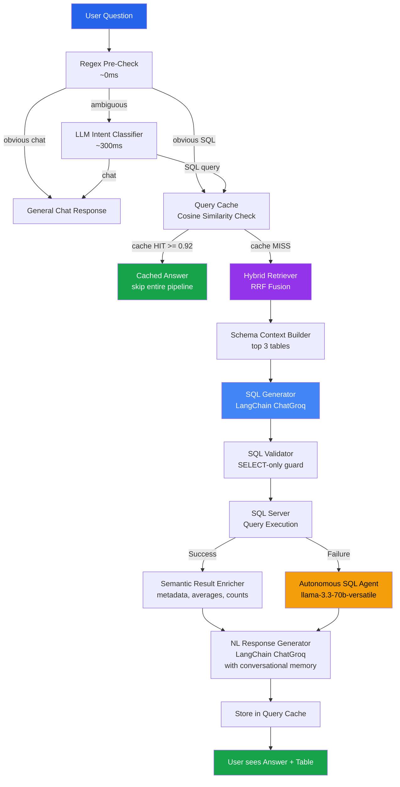
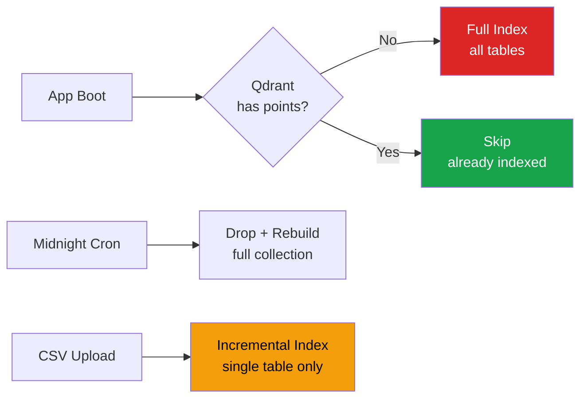
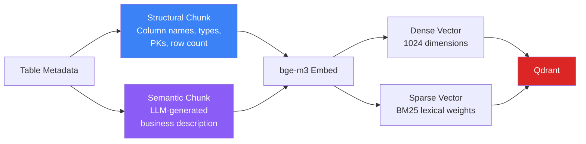

<p align="center">
  
  
  
  
  
</p>

<h1 align="center">AI SQL Analytics Assistant</h1>

<p align="center">
  <strong>Ask questions in plain English. Get SQL results instantly.</strong><br/>
  Enterprise-grade natural language to SQL pipeline powered by hybrid vector search and Groq Llama 3.
</p>

---

## What It Does

Business users type questions like **"Show me the top 10 customers by revenue last quarter"** and the system:

1. Finds the right tables using hybrid semantic search
2. Generates a safe, validated SQL query via LangChain and Groq
3. Executes it against SQL Server
4. Returns results with a natural language summary

No SQL knowledge required. No manual table selection. Works across 100+ tables.

---

## Tech Stack

| Layer | Technology | Purpose |
|:------|:-----------|:--------|
| **Frontend** | Streamlit | Chat UI (with Developer Mode toggle) + CSV upload |
| **Embedding** | BAAI/bge-m3 (local) | Dense 1024-dim + sparse BM25 vectors (cached) |
| **Vector DB** | Qdrant (Docker) | Schema index + query cache |
| **Hybrid Search** | Qdrant RRF Fusion | Merges dense + sparse results |
| **Query Cache** | Qdrant cosine similarity | Threshold: 0.92 |
| **Description Cache** | Local JSON file | Hash-keyed by schema signature |
| **Memory Layer** | mem0 Cloud API | Conversational memory, semantic fact extraction, context retrieval |
| **Intent Router** | Regex + LangChain ChatGroq | Dynamic sample-value checking, LCEL fallback |
| **Query Transformer**| LangChain LCEL + ChatGroq | Query decomposition, synonym rewriter, and step-back prompting |
| **SQL Generation** | LangChain LCEL + ChatGroq | Structured SQL generation chain |
| **Autonomous Agent** | LangChain SQL Agent | Tool-calling fallback for schema correction and query repair |
| **Semantic Enricher** | Pandas + SQLAlchemy | Computes averages, previews/truncations, count query indicators |
| **NL Response** | LangChain LCEL + ChatGroq | Context-aware response generator (grounded, no currency assumptions) |
| **Scheduler** | APScheduler | Nightly full re-index |
| **DB Driver** | SQLAlchemy + pyodbc | Connection pooling, Windows Auth |

---

## System Architecture

### High-Level Overview



### Phase 1: Offline Indexing Pipeline



### Phase 2: Online Query Pipeline



### Indexing Trigger Logic



### Dual Chunking Strategy



---

## Project Structure

```
ai-sql-assistant/
│
├── app.py                           # Streamlit entry point
│
├── database/                        # Database layer
│   ├── sql_server.py                #   SQLAlchemy engine + connection pooling
│   ├── schema_manager.py            #   Schema metadata extraction (cached)
│   └── csv_uploader.py              #   CSV parse + upload + re-index trigger
│
├── indexing/                        # Offline indexing pipeline
│   ├── embedder.py                  #   BAAI/bge-m3 wrapper (cached, dense + sparse)
│   ├── schema_extractor.py          #   Formats schema for chunk builder
│   ├── chunk_builder.py             #   Structural + semantic chunk creation
│   ├── semantic_description.py      #   LLM descriptions with JSON cache
│   ├── qdrant_uploader.py           #   Upsert chunks to Qdrant
│   └── index_manager.py            #   Startup / scheduler / incremental triggers
│
├── retrieval/                       # Online query pipeline
│   ├── query_router.py              #   Regex pre-check + dynamic sample checks + LLM intent
│   ├── table_retriever.py           #   Hybrid RRF search against Qdrant
│   └── query_cache.py               #   Cache read/write via Qdrant
│
├── analysis/
│   ├── schema_context.py            #   Build schema prompt for LLM
│   └── result_enricher.py           #   Statistical summaries, previews, aggregates, count flags
│
├── llm/
│   ├── llm_client.py                #   Lazy-loaded ChatGroq with API fallbacks
│   ├── query_transformer.py         #   Query decomposition, rewriting, step-back prompting
│   ├── query_ai.py                  #   Groq SQL generation (comparative & windowed rules)
│   ├── response_generator.py        #   Groq NL response (grounded, currency controls, memory context)
│   ├── describe_generator.py        #   Plain English table descriptions / database overviews
│   └── langchain_agent.py           #   Autonomous SQL Agent self-correcting fallback
│
├── memory/                          # Conversational memory layer
│   └── mem0_manager.py              #   mem0 Cloud client context management
│
├── workflow/
│   ├── process_query.py             #   End-to-end orchestration (history formatter)
│   └── query_executor.py            #   Safe SQL execution with limits
│
├── pages/                           # Streamlit UI pages
│   ├── chat_page.py                 #   Chat interface (Developer Mode)
│   └── upload_page.py               #   CSV upload interface
│
├── logs/                            # Application logs
├── data/uploads/                    # Uploaded CSV files
├── cache/                           # Local cache files
└── .env                             # Configuration
```

---

## Qdrant Collections

| Collection | Purpose | Vector Types |
|:-----------|:--------|:-------------|
| `sql_table_schemas` | Schema index — 2 chunks per table | Dense (1024) + Sparse (BM25) |
| `query_cache` | Past query results — cosine hit bypass | Dense only (1024) |

---

## Quick Start

### Prerequisites
- Python 3.11+
- SQL Server Express (running)
- Docker (for Qdrant)

### Setup

```bash
# 1. Clone
git clone https://github.com/nakul-cloud/ai-sql-assistant.git
cd ai-sql-assistant

# 2. Virtual environment
python -m venv .venv
.\.venv\Scripts\activate        # Windows

# 3. Install dependencies
pip install -r requirements.txt

# 4. Start Qdrant
docker run -d -p 6333:6333 --name qdrant qdrant/qdrant

# 5. Configure .env
# Copy the template and fill in your SQL Server, Groq API key, etc.

# 6. Run
streamlit run app.py
```

### Verify Components

Each module has a standalone test. Run from the project root:

```bash
python -m database.sql_server          # Test DB connection
python -m database.schema_manager      # Extract schema metadata
python -m database.csv_uploader        # CSV upload round-trip
python -m indexing.embedder            # BAAI/bge-m3 embedding test
python -m indexing.schema_extractor    # Schema extraction + formatting
python -m llm.llm_client               # Test LangChain client connection
python -m llm.query_ai                 # Test SQL query generator chain
python -m llm.response_generator       # Test NL answer generator chain
python -m retrieval.query_router       # Test router intent classifier chain
python -m llm.langchain_agent          # Test autonomous SQL tool-calling agent
```

---

## How It Works

### Step 1 — Indexing (Offline)
> Runs at app startup, nightly via scheduler, or on CSV upload.

1. **Extract** schema metadata from SQL Server (tables, columns, types, PKs, sample values)
2. **Build** two chunks per table:
   - **Structural** — column names, types, primary keys, row count
   - **Semantic** — LLM-generated business description (cached in JSON)
3. **Embed** each chunk with BAAI/bge-m3 (dense 1024-dim + sparse BM25)
4. **Upsert** into Qdrant `sql_table_schemas` collection

### Step 2 — Query Routing & Contextualization (Online)
> Decides how to handle each user message.

1. **Query Contextualization**: Rephrases follow-up queries using facts retrieved from **mem0 Cloud** and conversational flow to make them self-contained standalone queries (e.g., resolving pronouns like "their" or "they").
2. **Regex Pre-check**: Catches greetings, thanks, obvious SQL patterns, or descriptions (~40% of messages, 0ms). Bypasses LLM classification if direct matches occur.
3. **Intent Router**: Ambiguous queries are classified by ChatGroq into:
   - `CHAT`: General greeting/conversational talk.
   - `SQL_QUERY`: Analytical queries requiring database execution.
   - `SCHEMA_INFO`: Questions about database tables or overall catalog structures.
   - `DESCRIBE`: Requests to summarize a table or the entire database.
   - `DATA_PREVIEW`: Direct requests to see preview records.
   - `SCHEMA_EXPLANATION`: Requests to explain column definitions (e.g., "what is ssc_p?").
   - `CONVERSATION_SUMMARY`: Summarizing previous topics discussed using mem0 memory logs.
   - `TEMPORAL` / `GENERAL_KNOWLEDGE`: Questions out of database/assistant scope.

### Step 3 — Query Execution & Response (Online)
> Full pipeline for analytical database queries.

1. **Query Cache Check**: Cosine similarity >= 0.92 against past cached questions returns cached responses instantly.
2. **Advanced Query Transformations**:
   - **Decomposition**: Splits compound questions into independent sub-queries.
   - **Rewriting**: Maps colloquial business terms to correct database column names.
   - **Step-Back Prompting**: Formulates a broader search query to retrieve baseline metrics for narrow entities.
3. **Hybrid Retrieval**: RRF fusion of dense (BGE-M3) and sparse (BM25) vector searches in Qdrant, returning the top 3 tables.
4. **Schema Context**: Formulates a schema context prompt containing table row counts, column types, primary keys, and distinct sample values.
5. **SQL Generation**: LangChain ChatGroq LCEL chain generates a SELECT query applying comparative and windowed baseline guidelines.
6. **Validation**: Inspects generated SQL block to enforce read-only SELECT/WITH statements and block semicolon injections.
7. **Execution & Fallback**:
   - **Standard Path**: Executes query against SQL Server using connection pools.
   - **Fallback Path**: If standard SQL execution fails, the **Autonomous LangChain SQL Agent** (`llama-3.3-70b-versatile`) is triggered to inspect schemas, self-heal syntactical issues, and retrieve the correct results.
8. **Semantic Enrichment**: Analyzes results using Pandas to generate statistical summaries, check for truncation or count structures, and fetch global average baseline values.
9. **NL Response**: Generates a conversational summary grounded strictly on evidence, enforcing currency limitations, speculation blocking, and isolation boundaries.
10. **Persistence**: Asynchronously logs extracted facts into the mem0 Cloud memory, and stores the query result in the Qdrant query cache.

---

## Configuration (.env)

| Variable | Description | Default |
|:---------|:------------|:--------|
| `SQL_SERVER` | SQL Server instance | `localhost\SQLEXPRESS` |
| `SQL_DATABASE` | Target database | `ai_sql_assistant` |
| `SQL_TRUSTED_CONNECTION` | Windows Auth | `yes` |
| `GROQ_API_KEY` | Groq API key | — |
| `GROQ_MODEL` | Groq model identifier | `llama-3.1-8b-instant` |
| `QDRANT_HOST` | Qdrant server | `localhost` |
| `QDRANT_PORT` | Qdrant port | `6333` |
| `EMBEDDING_MODEL` | Embedding model | `BAAI/bge-m3` |
| `QUERY_CACHE_THRESHOLD` | Cache hit similarity | `0.92` |
| `SQL_POOL_SIZE` | Connection pool size | `10` |
| `SQL_MAX_OVERFLOW` | Max pool overflow | `20` |

---

## Build Progress

| # | Component | Status |
|:--|:----------|:-------|
| 1 | `database/sql_server.py` | ✅ Done |
| 2 | `database/schema_manager.py` | ✅ Done |
| 3 | `database/csv_uploader.py` | ✅ Done |
| 4 | `indexing/embedder.py` | ✅ Done |
| 5 | `indexing/schema_extractor.py` | ✅ Done |
| 6 | `indexing/semantic_description.py` | ✅ Done |
| 7 | `indexing/chunk_builder.py` | ✅ Done |
| 8 | `indexing/qdrant_uploader.py` | ✅ Done |
| 9 | `indexing/index_manager.py` | ✅ Done |
| 10 | `retrieval/query_router.py` | ✅ Done |
| 11 | `retrieval/table_retriever.py` | ✅ Done |
| 12 | `retrieval/query_cache.py` | ✅ Done |
| 13 | `analysis/schema_context.py` | ✅ Done |
| 14 | `analysis/result_enricher.py` | ✅ Done |
| 15 | `llm/query_ai.py` | ✅ Done |
| 16 | `llm/response_generator.py` | ✅ Done |
| 17 | `workflow/process_query.py` | ✅ Done |
| 18 | `workflow/query_executor.py` | ✅ Done |
| 19 | `pages/chat_page.py` | ✅ Done |
| 20 | `pages/upload_page.py` | ✅ Done |
| 21 | `app.py` | ✅ Done |

---

## License

MIT © 2026 Nakul

---

<p align="center">
  <em>Built for enterprise teams who want AI-powered analytics without the complexity.</em>
</p>
