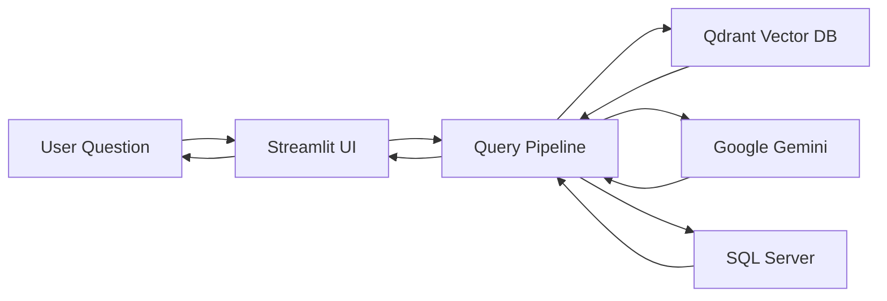
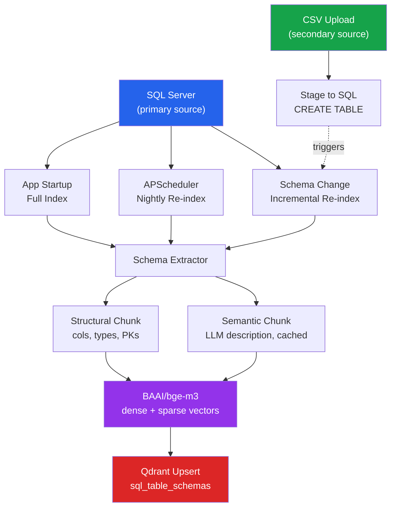
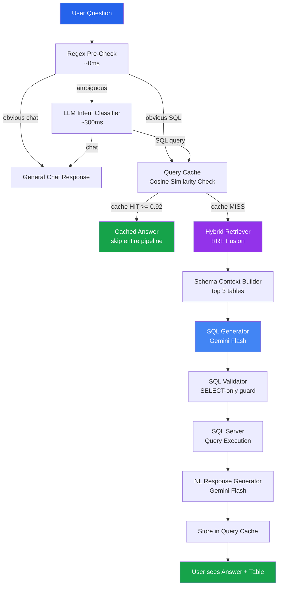
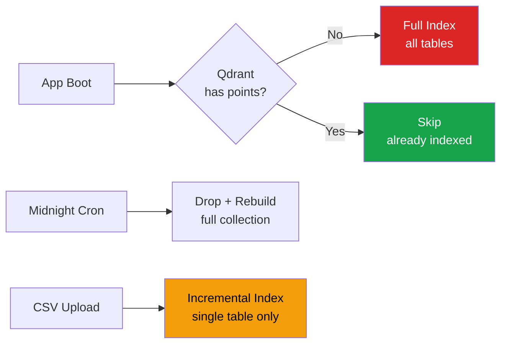
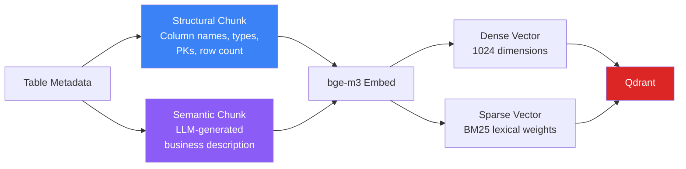

<p align="center">
  
  
  
  
  
</p>

<h1 align="center">AI SQL Analytics Assistant</h1>

<p align="center">
  <strong>Ask questions in plain English. Get SQL results instantly.</strong><br/>
  Enterprise-grade natural language to SQL pipeline powered by hybrid vector search and Google Gemini.
</p>

---

## What It Does

Business users type questions like **"Show me the top 10 customers by revenue last quarter"** and the system:

1. Finds the right tables using hybrid semantic search
2. Generates a safe, validated SQL query via Gemini
3. Executes it against SQL Server
4. Returns results with a natural language summary

No SQL knowledge required. No manual table selection. Works across 100+ tables.

---

## Tech Stack

| Layer | Technology | Purpose |
|:------|:-----------|:--------|
| **Frontend** | Streamlit | Chat UI + CSV upload |
| **Embedding** | BAAI/bge-m3 (local) | Dense 1024-dim + sparse BM25 vectors |
| **Vector DB** | Qdrant (Docker) | Schema index + query cache |
| **Hybrid Search** | Qdrant RRF Fusion | Merges dense + sparse results |
| **Query Cache** | Qdrant cosine similarity | Threshold: 0.92 |
| **Description Cache** | Local JSON file | Hash-keyed by schema signature |
| **Intent Router** | Regex + Gemini Flash Lite | Regex first, LLM only if ambiguous |
| **SQL Generation** | Google Gemini Flash | Natural language to SQL |
| **NL Response** | Google Gemini Flash | Results to human-readable answer |
| **Scheduler** | APScheduler | Nightly full re-index |
| **DB Driver** | SQLAlchemy + pyodbc | Connection pooling, Windows Auth |

---

## System Architecture

### High-Level Overview



### Phase 1: Offline Indexing Pipeline



### Phase 2: Online Query Pipeline



### Indexing Trigger Logic



### Dual Chunking Strategy



---

## Project Structure

```
ai-sql-assistant/
│
├── app.py                           # Streamlit entry point
│
├── database/                        # Database layer
│   ├── sql_server.py                #   SQLAlchemy engine + connection pooling
│   ├── schema_manager.py            #   Schema metadata extraction
│   └── csv_uploader.py              #   CSV parse + upload + re-index trigger
│
├── indexing/                        # Offline indexing pipeline
│   ├── embedder.py                  #   BAAI/bge-m3 wrapper (dense + sparse)
│   ├── schema_extractor.py          #   Formats schema for chunk builder
│   ├── chunk_builder.py             #   Structural + semantic chunk creation
│   ├── semantic_description.py      #   LLM descriptions with JSON cache
│   ├── qdrant_uploader.py           #   Upsert chunks to Qdrant
│   └── index_manager.py            #   Startup / scheduler / incremental triggers
│
├── retrieval/                       # Online query pipeline
│   ├── query_router.py              #   Regex pre-check + LLM intent classifier
│   ├── table_retriever.py           #   Hybrid RRF search against Qdrant
│   └── query_cache.py               #   Cache read/write via Qdrant
│
├── analysis/
│   └── schema_context.py            #   Build schema prompt for LLM
│
├── llm/
│   ├── query_ai.py                  #   Gemini SQL generation
│   └── response_generator.py        #   Gemini NL response
│
├── workflow/
│   ├── process_query.py             #   End-to-end query orchestration
│   └── query_executor.py            #   Safe SQL execution
│
├── pages/                           # Streamlit UI pages
│   ├── chat_page.py                 #   Chat interface
│   └── upload_page.py               #   CSV upload interface
│
├── logs/                            # Application logs
├── data/uploads/                    # Uploaded CSV files
├── cache/                           # Local cache files
└── .env                             # Configuration
```

---

## Qdrant Collections

| Collection | Purpose | Vector Types |
|:-----------|:--------|:-------------|
| `sql_table_schemas` | Schema index — 2 chunks per table | Dense (1024) + Sparse (BM25) |
| `query_cache` | Past query results — cosine hit bypass | Dense only (1024) |

---

## Quick Start

### Prerequisites
- Python 3.11+
- SQL Server Express (running)
- Docker (for Qdrant)

### Setup

```bash
# 1. Clone
git clone https://github.com/nakul-cloud/ai-sql-assistant.git
cd ai-sql-assistant

# 2. Virtual environment
python -m venv .venv
.\.venv\Scripts\activate        # Windows

# 3. Install dependencies
pip install -r requirements.txt

# 4. Start Qdrant
docker run -d -p 6333:6333 --name qdrant qdrant/qdrant

# 5. Configure .env
# Copy the template and fill in your SQL Server, Gemini API key, etc.

# 6. Run
streamlit run app.py
```

### Verify Components

Each module has a standalone test. Run from the project root:

```bash
python -m database.sql_server          # Test DB connection
python -m database.schema_manager      # Extract schema metadata
python -m database.csv_uploader        # CSV upload round-trip
python -m indexing.embedder            # BAAI/bge-m3 embedding test
python -m indexing.schema_extractor    # Schema extraction + formatting
```

---

## How It Works

### Step 1 — Indexing (Offline)
> Runs at app startup, nightly via scheduler, or on CSV upload.

1. **Extract** schema metadata from SQL Server (tables, columns, types, PKs, sample values)
2. **Build** two chunks per table:
   - **Structural** — column names, types, primary keys, row count
   - **Semantic** — LLM-generated business description (cached in JSON)
3. **Embed** each chunk with BAAI/bge-m3 (dense 1024-dim + sparse BM25)
4. **Upsert** into Qdrant `sql_table_schemas` collection

### Step 2 — Query Routing (Online)
> Decides how to handle each user message.

1. **Regex pre-check** — catches greetings, thanks, obvious SQL patterns (~40% of messages, 0ms)
2. **LLM intent classifier** — only called for ambiguous messages (~300ms)
3. Routes to: `CHAT`, `SQL_QUERY`, or `SCHEMA_INFO`

### Step 3 — Query Execution (Online)
> Full pipeline for SQL-intent queries.

1. **Query cache check** — cosine similarity > 0.92 returns cached answer instantly
2. **Hybrid retrieval** — RRF fusion of dense + sparse search, returns top 3 tables
3. **Schema context** — builds a detailed prompt with column info + sample values
4. **SQL generation** — Gemini Flash produces a SELECT query
5. **Validation** — ensures only SELECT statements pass through
6. **Execution** — runs against SQL Server, returns results
7. **NL response** — Gemini Flash summarizes results in plain English
8. **Cache store** — saves the query + response for future cache hits

---

## Configuration (.env)

| Variable | Description | Default |
|:---------|:------------|:--------|
| `SQL_SERVER` | SQL Server instance | `localhost\SQLEXPRESS` |
| `SQL_DATABASE` | Target database | `ai_sql_assistant` |
| `SQL_TRUSTED_CONNECTION` | Windows Auth | `yes` |
| `GEMINI_API_KEY` | Google Gemini API key | — |
| `QDRANT_HOST` | Qdrant server | `localhost` |
| `QDRANT_PORT` | Qdrant port | `6333` |
| `EMBEDDING_MODEL` | Embedding model | `BAAI/bge-m3` |
| `QUERY_CACHE_THRESHOLD` | Cache hit similarity | `0.92` |
| `SQL_POOL_SIZE` | Connection pool size | `10` |
| `SQL_MAX_OVERFLOW` | Max pool overflow | `20` |

---

## Build Progress

| # | Component | Status |
|:--|:----------|:-------|
| 1 | `database/sql_server.py` | ✅ Done |
| 2 | `database/schema_manager.py` | ✅ Done |
| 3 | `database/csv_uploader.py` | ✅ Done |
| 4 | `indexing/embedder.py` | ✅ Done |
| 5 | `indexing/schema_extractor.py` | ✅ Done |
| 6 | `indexing/semantic_description.py` | ✅ Done |
| 7 | `indexing/chunk_builder.py` | ✅ Done |
| 8 | `indexing/qdrant_uploader.py` | ✅ Done |
| 9 | `indexing/index_manager.py` | ✅ Done |
| 10 | `retrieval/query_router.py` | ✅ Done |
| 11 | `retrieval/table_retriever.py` | ✅ Done |
| 12 | `retrieval/query_cache.py` | ✅ Done |
| 13 | `analysis/schema_context.py` | ✅ Done |
| 14 | `llm/query_ai.py` | ✅ Done |
| 15 | `llm/response_generator.py` | ✅ Done |
| 16 | `workflow/process_query.py` | ✅ Done |
| 17 | `workflow/query_executor.py` | ✅ Done |
| 18 | `pages/chat_page.py` | ✅ Done |
| 19 | `pages/upload_page.py` | ✅ Done |
| 20 | `app.py` | ✅ Done |

---

## License

MIT © 2026 Nakul

---

<p align="center">
  <em>Built for enterprise teams who want AI-powered analytics without the complexity.</em>
</p>
