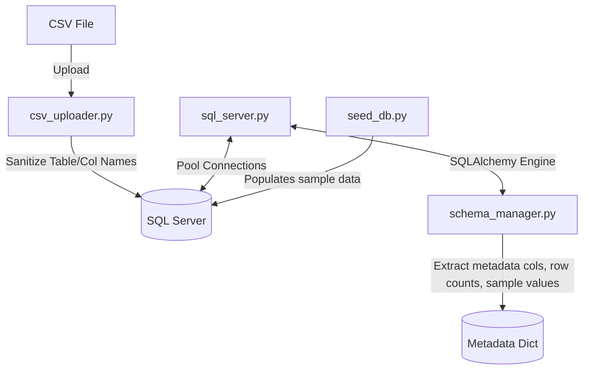

# Database Layer

This directory handles connection management, schema reflection, and table ingestion for the Enterprise AI SQL Assistant. It abstracts communication with SQL Server using SQLAlchemy and pyodbc, handles Windows/SQL authentication, cleans raw data files during upload, and provides seeding scripts.

---

## Component Architecture



---

## File Registry

### 1. `sql_server.py`
Exposes the core database engine:
- **Singleton Connection Pool**: Uses a module-level cached `Engine` instance so connections are shared.
- **Configurable Pooling**: Reads `SQL_POOL_SIZE`, `SQL_MAX_OVERFLOW`, and `SQL_TIMEOUT` settings.
- **Windows Integration**: Supports both standard username/password authentication and secure local Windows Authentication (`Trusted_Connection=yes`).
- **Ping Validation**: Employs `pool_pre_ping=True` to automatically recycle stale connections before using them.

### 2. `schema_manager.py`
Extracts database structure details for RAG:
- Queries metadata from `INFORMATION_SCHEMA.TABLES` and `COLUMNS`.
- Detects column names, SQL types, nullability, and primary key constraints.
- Employs fast system catalog queries (`sys.partitions`) to fetch row counts without causing performance hits.
- Extracts distinct values for column samples to provide natural-language context for the LLM.

### 3. `csv_uploader.py`
Manages CSV uploads to SQL Server:
- **Sanitization**: Standardizes table names with a `csv_` prefix and converts characters to safe alphanumeric underscores.
- **Batched Uploads**: Uses pandas `to_sql` with `chunksize=1000` to process large tables efficiently.
- **Index Triggers**: Integrates with the indexing layer to perform incremental vector upserts immediately after an upload completes.

### 4. `seed_db.py`
Seeds three business tables to verify pipeline functionality:
- `dbo.csv_departments`: Contains sample departments, managers, and office locations.
- `dbo.csv_employees`: Contains sample employee metadata, salaries, and department associations.
- `dbo.csv_sales`: Contains sample sales amounts, transaction dates, and product categories.

---

## Environment Configuration

These database variables in `.env` govern performance:

```ini
SQL_SERVER=localhost\SQLEXPRESS
SQL_DATABASE=ai_sql_assistant
SQL_TRUSTED_CONNECTION=yes
SQL_DRIVER=ODBC Driver 17 for SQL Server
SQL_POOL_SIZE=10
SQL_MAX_OVERFLOW=20
```

---

## Verification

Run database diagnostics directly from the command line:

```bash
# Verify connection
.venv\Scripts\python.exe -m database.sql_server

# Verify schema metadata extraction
.venv\Scripts\python.exe -m database.schema_manager

# Seed database tables
.venv\Scripts\python.exe -m database.seed_db
```
