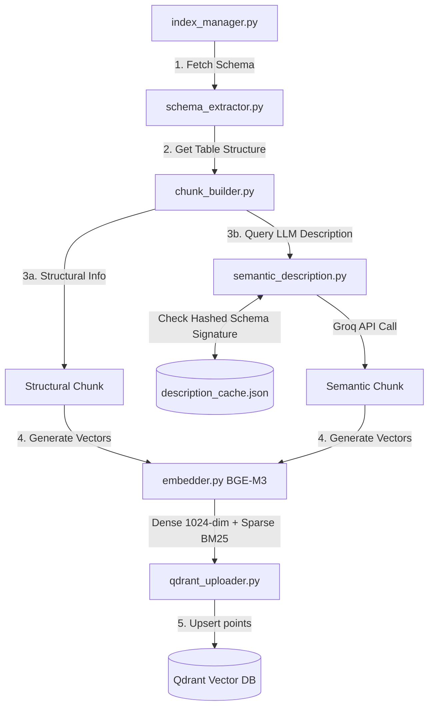

# Offline Indexing Pipeline

This directory manages the background extraction, chunking, embedding, and indexing of database schemas. It creates a searchable hybrid vector representations of the SQL Server database layout in Qdrant, optimizing subsequent retrievals.

---

## Ingestion Architecture



---

## File Registry

### 1. `embedder.py`
Local embedding service using `BAAI/bge-m3`:
- **Singleton Pattern**: Loads the model once and reuses it to prevent memory overhead.
- **Hardware Optimization**: Constrains PyTorch to `torch.set_num_threads(4)` to prevent thread contention on Windows hosts.
- **Warmup Call**: Runs a dummy encoding on startup to trigger graph compilation, keeping runtime latencies under 200ms.
- **Dual Outputs**: Generates 1024-dimensional dense vectors and sparse lexical weights in a single pass.

### 2. `schema_extractor.py`
Data transformer mapping the SQL Server layer to the indexing pipeline:
- Translates pyodbc objects into JSON structure dictionaries.
- Generates display layouts (e.g., matching SQL `nvarchar` to `nvarchar(MAX)`).

### 3. `chunk_builder.py`
Splits tables into complementary vector shapes:
- **Structural Chunks**: Exact listings of column names, data types, primary keys, and sample data. Optimizes lexical match queries.
- **Semantic Chunks**: Captures high-level business logic, describing what information the table models. Optimizes conceptual match queries.

### 4. `semantic_description.py`
Generates semantic details for tables:
- **LLM Synthesis**: Uses Groq Llama 3 to write concise business summaries of tables based on columns and values.
- **SHA-256 Signature Caching**: Hashes column layouts to create a signature. If the table layout matches `description_cache.json`, it reuses the cache, avoiding duplicate API costs.

### 5. `qdrant_uploader.py`
Vector database client:
- Configures collections with dual dense (Cosine) and sparse (BM25) vector indices.
- Handles ID generation, payload binding, and batch upserts.
- Deletes stale vector fragments before table updates to prevent duplicate data points.

### 6. `index_manager.py`
Pipeline coordinator:
- **`index_all_tables()`**: Drops, regenerates, and populates the schema collection.
- **`index_single_table()`**: Safely replaces individual tables to support fast CSV uploads without rebuilding the entire database index.

### 7. `scheduler.py`
Background task scheduler using `APScheduler`:
- Triggers database-wide index updates on application startup if Qdrant collections are empty.
- Schedules a full index verification cron job every night at 2:00 AM.

---

## Dual Chunking Details

Every database table is represented by two points in Qdrant:

| Chunk Type | Format | Query Optimization |
|:---|:---|:---|
| **Structural** | `Table: dbo.Employees`<br>`Columns: employee_id(int) [PK], name(varchar)...` | Direct match queries mentioning specific table or column names. |
| **Semantic** | `Table: dbo.Employees`<br>`This table lists personnel records, salaries...` | Conceptual queries discussing high-level business ideas. |

---

## Verification

Run standalone indexers from the command line:

```bash
# Verify FlagEmbedding BGE-M3 extraction
.venv\Scripts\python.exe -m indexing.embedder

# Test LLM description and caching
.venv\Scripts\python.exe -m indexing.semantic_description

# Re-index all tables
.venv\Scripts\python.exe -m indexing.index_manager
```
