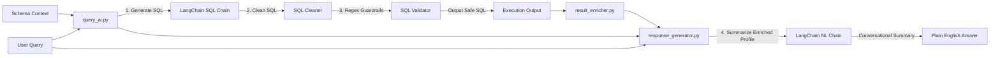

# Large Language Model (LLM) Layer

This directory handles prompt contexts, runs LangChain LCEL chains, and validates generated SQL statements to prevent security issues.

---

## Processing Pipeline



---

## File Registry

### 0. `llm_client.py`
Provides the shared, cached `get_llm()` model provider using LangChain's `ChatGroq` wrapper. Uses a lazy-initialized singleton for raw completions (`generate_text`) to preserve offline indexing functionality.

### 1. `query_ai.py`
Generates SQL queries from user questions using LangChain's ChatPromptTemplate and LCEL:
- **Prompt Isolation**: Directs the LLM using SQL Server instructions (e.g., using `TOP` instead of `LIMIT`, referencing specific schema columns).
- **Output Sanitization**: Removes markdown formatting block tags (e.g. ` ```sql `) to produce clean SQL statements ready for execution.
- **SQL Validator (Security Guardrail)**: Checks generated SQL query blocks against security rules before running them on SQL Server:
  - **SELECT-Only Enforcement**: Ensures queries start with `SELECT`. Rejects updates, inserts, and deletions.
  - **Single Statement Enforcement**: Rejects queries with semicolons `;` that attempt to run multiple statements.
  - **Keyword Blocklist**: Filters out commands like `DROP`, `TRUNCATE`, `ALTER`, `EXEC`, and `CREATE`.
  - **Procedure Blocklist**: Blocks critical system stored procedures (e.g., `xp_cmdshell`, `sp_executesql`, `openrowset`).

### 2. `response_generator.py`
Converts raw database results into clear, conversational summaries using LangChain:
- **Analyst Persona**: Guides the model to output summaries focused on business metrics, avoiding database terminology and table names.
- **Context Injection**: Ingests an enriched statistical profile (sums, means, unique counts) instead of raw datasets. This prevents token bloat and speeds up natural language generation.

### 3. `langchain_agent.py`
Executes an autonomous SQL agent using LangChain's `create_sql_agent` with native tool-calling (`agent_type="tool-calling"`):
- **Self-Healing**: Triggered automatically if normal execution fails or on request to discover columns, self-correct queries, and perform multi-step database reasoning.

---

## Security Validation Policy

The SQL Validator checks generated SQL against these policies to keep database operations safe:

| Action | Allowed | Rationale |
|:---|:---:|:---|
| `SELECT ...` | ✅ Yes | Safe read-only data query. |
| `SELECT ...; DROP TABLE ...` | ❌ No | Blocks multi-statement injection. |
| `UPDATE ...` / `DELETE ...` | ❌ No | Prevents data modifications. |
| `EXEC xp_cmdshell ...` | ❌ No | Prevents remote server command execution. |
| `SELECT * FROM openrowset(...)` | ❌ No | Blocks unauthorized file reads or connections. |

---

## Verification

Test the components from the project root:

```bash
# Test LangChain client connection
.venv\Scripts\python.exe -m llm.llm_client

# Test SQL query generation and validation
.venv\Scripts\python.exe -m llm.query_ai

# Test conversational summary generation
.venv\Scripts\python.exe -m llm.response_generator

# Test autonomous tool-calling SQL agent
.venv\Scripts\python.exe -m llm.langchain_agent
```
