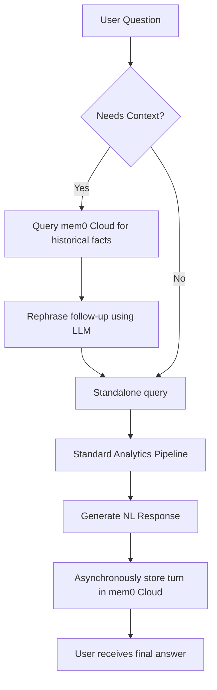

# Conversational Memory Layer

This directory manages conversational memory for the Enterprise AI SQL Assistant using the **mem0 Cloud API**. It enables the assistant to remember past user interactions, recall relevant facts about prior queries, and support context-aware follow-up questions.

---

## Memory Flow Architecture



---

## File Registry

### 1. `mem0_manager.py`
The core memory coordinator:
- **`init_memory()`**: Connects to the mem0 Cloud using your API key. It is lazy-loaded and cached in `app.py` as a Streamlit resource.
- **`store()`**: Saves a conversation turn (user question and assistant response) asynchronously in a background thread. When SQL queries are executed, it appends a compact representation of columns and top row results (e.g. `col1=val1, col2=val2`) so the mem0 extractor can pull concrete numbers and facts from data tables.
- **`needs_contextualization()`**: A heuristic function checking if a query contains pronouns (e.g. "it", "them", "their"), generic table/data references (e.g. "rows", "preview", "statistics"), transition phrases (e.g. "what about", "compare"), or lacks table names.
- **`contextualize()`**: Rephrases conversational follow-ups into standalone analytical queries by retrieving relevant past facts from the mem0 Cloud and utilizing Groq to build a fully qualified query.
- **`get_context_for_prompt()`**: Pulls the top 5 semantically relevant historical facts for the current query and returns them as a bulleted text block for injection into the response generator prompt.
- **`clear_user_memory()`** and **`get_all_memories()`**: Helper utilities to manage user memories for testing or display in the UI.

---

## How it Integrates with the Pipeline

The memory layer is integrated in two distinct phases of `workflow/process_query.py`:

1. **Pre-Execution (Contextualization)**:
   - When a new query is received, the system checks if it is a follow-up query using `needs_contextualization()`.
   - If yes, the query is rephrased via `contextualize()` before routing, table retrieval, and SQL generation.
2. **Post-Execution (Fact Storage)**:
   - Once the final natural language summary is generated, the system calls `store()` in a background thread.
   - This keeps the interface fast while ensuring the conversation history is instantly updated.

---

## Verification

Test the memory manager connection and retrieval from the command line:

```bash
.venv\Scripts\python.exe -m memory.mem0_manager
```
