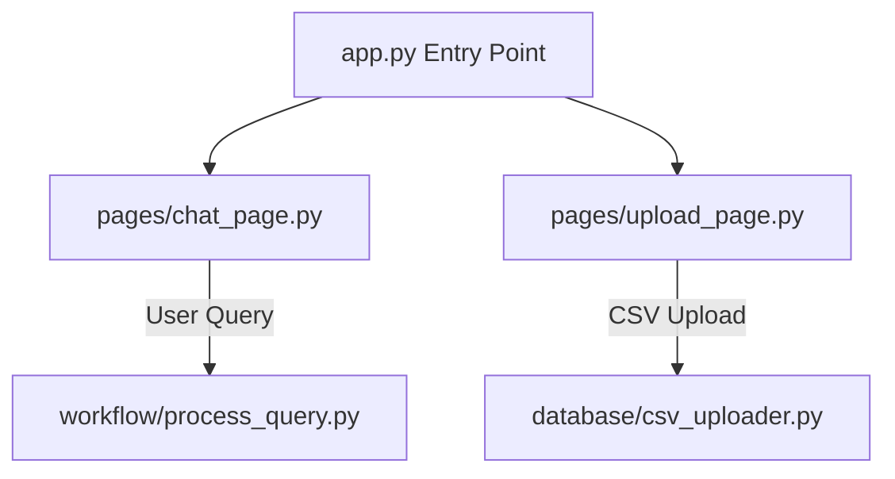

# Streamlit UI Pages

This directory houses the UI components of the AI SQL Assistant, built using Streamlit. It defines the application's layout, controls, and workflows.

---

## UI Layout

---

## File Registry

### 1. `chat_page.py`
The primary interface for natural language queries:
- **Chat Feed**: Displays user questions and assistant responses in an interactive conversation thread.
- **Developer Mode Toggle**: Located in the sidebar. When turned on, it reveals details like generated SQL statements and retrieval scores.
- **Focus Tables Selector**: Allows users to select specific database tables to search, overriding the automatic retrieval.
- **Chat Reset**: Provides a button to clear the conversation history and start fresh.

### 2. `upload_page.py`
The administration page for loading CSV data:
- **Connection Checks**: Tests the database connection on page load and displays alerts if the SQL Server is offline.
- **CSV Parser & Validator**: Inspects uploaded files for size limits, column headers, and encoding formats.
- **Preview Panel**: Shows a table with the first 5 rows of the uploaded file along with key metrics like row and column counts.
- **Target Table Selector**: Allows users to write to a new table or append data to an existing one.
- **Index trigger**: Clicking "Upload & Index Table" uploads the data to SQL Server and indexes the schema in Qdrant automatically.

---

## Streamlit Sidebar Controls

| Sidebar Setting | Type | Purpose |
|:---|:---:|:---|
| **Developer Mode** | Toggle | Shows or hides technical details like SQL code and retrieval scores. |
| **Focus Tables** | Multiselect | Limits the schema context to specific tables, overriding automatic search. |
| **Clear Conversation**| Button | Resets session state variables and clears the chat screen. |
