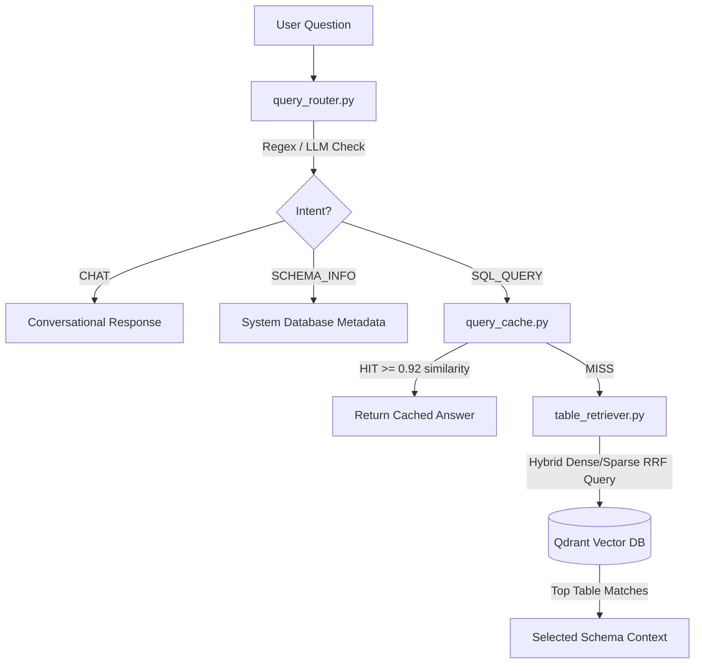

# Retrieval & Router Layer

This directory directs incoming user queries, performs hybrid vector searches to identify target tables, and manages semantic query caching to reuse database answers.

---

## Retrieval Flow



---

## File Registry

### 1. `query_router.py`
Determines user intent using a tiered classification strategy:
- **Regex Check**: Screens inputs against pre-defined patterns (greetings, thanks, explicit database commands). Routes common requests instantly without calling APIs.
- **LLM Fallback**: Ambiguous queries are classified by Gemini Flash into one of three categories:
  1. `CHAT`: Conversational messages.
  2. `SQL_QUERY`: Requests to query or analyze table data.
  3. `SCHEMA_INFO`: Inquiries about database tables, columns, or keys.

### 2. `table_retriever.py`
Finds database tables using a hybrid search algorithm in Qdrant:
- **Parallel Querying**: Fetches tables using dense vector matching (for conceptual similarities) and sparse vector matching (for exact schema names) simultaneously.
- **Reciprocal Rank Fusion (RRF)**: Merges dense and sparse vector matches to yield a unified relevance list.
- **Observability**: Prints scores, rankings, chunk types, and text snippets to the terminal for debugging:
  ```
  Rank 01 | Score: 0.0321 | Table: dbo.csv_employees | Type: structural | Snippet: Table: dbo.csv_employees Columns...
  Rank 02 | Score: 0.0164 | Table: dbo.csv_employees | Type: semantic   | Snippet: Table: dbo.csv_employees Tracks...
  ```

### 3. `query_cache.py`
Caches natural language responses in a separate Qdrant collection:
- **Semantic Matching**: Checks incoming questions against previously cached queries using cosine similarity.
- **Fast Hits**: If a query matches a cached item with a similarity score `>= 0.92`, it returns the cached response instantly, avoiding redundant database connections and API costs.
- **Storage Limits**: Stores only the first 50 records of query results to keep the vector payloads light.

---

## Router Intent Definitions

| Intent | Routing Rule | Next Pipeline Step |
|:---|:---|:---|
| **`CHAT`** | Matches greetings, thank-you messages, and conversational text. | Simple Gemini conversational response. |
| **`SCHEMA_INFO`** | Matches questions asking about active tables, metadata, or table columns. | Schema context synthesis summarizing the database metadata. |
| **`SQL_QUERY`** | Matches requests for statistics, aggregations, or list views. | Runs the hybrid retrieval, SQL generation, and database execution pipeline. |

---

## Verification

Test the retrieval components independently:

```bash
# Verify intent routing
.venv\Scripts\python.exe -m retrieval.query_router

# Test hybrid RRF table retrieval
.venv\Scripts\python.exe -m retrieval.table_retriever

# Test semantic caching
.venv\Scripts\python.exe -m retrieval.query_cache
```
