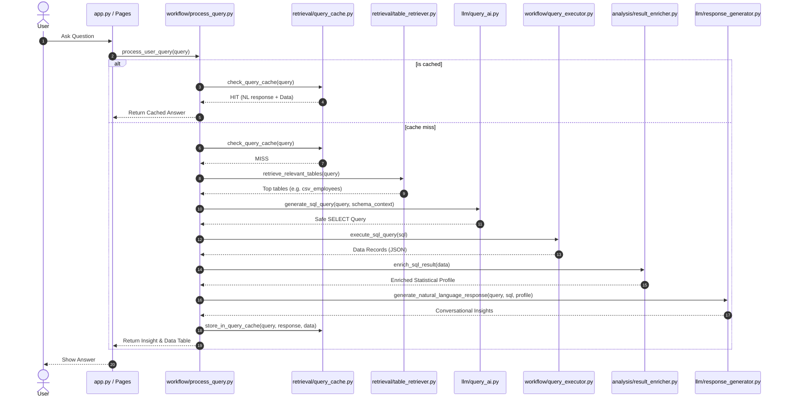

# Query Execution Workflow

This directory orchestrates the request lifecycle of the Enterprise AI SQL Assistant. It manages query routing, caching, vector search retrieval, SQL generation, safe execution, and summary reporting.

---

## Workflow Sequence



---

## File Registry

### 1. `process_query.py`
The master coordinator for user requests:
- **`process_user_query()`**: Entry point that coordinates the entire workflow based on intent:
  - **Conversational Memory Rephrasing**: Uses `memory/mem0_manager.py` to check if a query is a follow-up query. If so, it rephrases the query using retrieved conversational facts to make it self-contained.
  - **Intent Classification**: Routes queries to intents: `CHAT` (general conversation), `SCHEMA_INFO` (database metadata structure), `SCHEMA_EXPLANATION` (column meanings), `DESCRIBE` (dataset descriptions), `DATA_PREVIEW` (direct sample previews), `CONVERSATION_SUMMARY` (past discussion recaps), `TEMPORAL` / `GENERAL_KNOWLEDGE` (refusals), or `SQL_QUERY` (analytical database requests).
  - **Advanced Query Transformations**: Applies query decomposition, rewriting, and step-back prompting. If a query is decomposed, it executes each sub-query independently and combines the final natural language answers.
  - **Cache Lookup**: Looks up queries in the semantic cache to bypass the retrieval and LLM stages on hits.
  - **Hybrid Schema Retrieval**: Merges dense and sparse vectors via reciprocal rank fusion to find relevant tables.
  - **LLM SQL Generation**: Invokes ChatGroq with detailed schema context to write the T-SQL query.
  - **Safe Execution & Autonomous Repair Fallback**: Validates and runs the SQL. If execution fails, it automatically falls back to `llm/langchain_agent.py` to self-correct the query and execute it autonomously.
  - **Semantic Enrichment & NL Response**: Analyzes database records using Pandas to extract summary statistics, passes it to the response generator, and returns the natural language response.
  - **Memory & Cache Persistence**: Stores facts extracted from the interaction into mem0 Cloud and saves results to the semantic query cache.

### 2. `query_executor.py`
Executes SQL queries on SQL Server safely:
- **Lock Timeout**: Sets `SET LOCK_TIMEOUT 30000` (30 seconds) on every connection checkout to prevent queries from hanging the database server.
- **Row Enforcement**: Modifies queries to inject a `TOP 1000` clause if no row limit is specified, protecting memory and network traffic.
- **Serialization**: Converts SQLAlchemy DataFrames into JSON-ready records and handles datetime columns safely.

---

## Query Pipeline Details

```
Input: "Who is the manager of each department, and how much did they spend?"
 │
 ├── 1. Contextualization ──> Resolves pronouns or incomplete queries using mem0 history
 ├── 2. Router ─────────────> Detects SQL_QUERY intent
 ├── 3. Transformation ─────> Decomposes/rewrites query, or generates step-back query
 ├── 4. Cache ──────────────> Cosine query cache search (MISS)
 ├── 5. Retriever ──────────> Hybrid search returns top tables: ["dbo.csv_departments"]
 ├── 6. Schema Context ─────> Generates database schema context block (columns + samples)
 ├── 7. SQL Gen ────────────> Generates: "SELECT department_name, manager_name FROM dbo.csv_departments"
 ├── 8. Executor ───────────> Runs T-SQL query. (Fallback to LangChain Agent if error occurs)
 ├── 9. Enricher ───────────> Builds statistical profiles and flags count/truncation shapes
 ├── 10. NL Insights ───────> Summarizes findings using ChatGroq grounded response prompts
 └── 11. Persistence ───────> Saves response in query cache and registers new facts in mem0 Cloud
```

---

## Verification

Test the query workflow directly from the command line:

```bash
# Verify the entire execution pipeline (router -> retriever -> sql -> executor -> cache)
.venv\Scripts\python.exe -m workflow.process_query

# Test connection timeouts and limits
.venv\Scripts\python.exe -m workflow.query_executor
```
