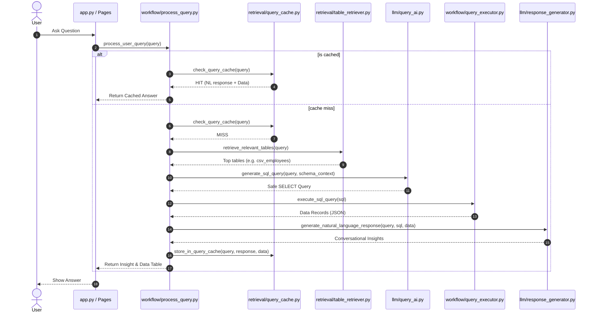

# Query Execution Workflow

This directory orchestrates the request lifecycle of the Enterprise AI SQL Assistant. It manages query routing, caching, vector search retrieval, SQL generation, safe execution, and summary reporting.

---

## Workflow Sequence



---

## File Registry

### 1. `process_query.py`
The master coordinator for user requests:
- **`process_user_query()`**: Directs the flow based on intent:
  - **`CHAT`**: Generates a quick conversational response.
  - **`SCHEMA_INFO`**: Reads the active database schemas to answer structural questions.
  - **`SQL_QUERY`**: Runs the complete RAG execution pipeline.
- **Cache check**: Checks the cache first. If a match is found, it skips the retrieval and SQL steps entirely.
- **Table Scope Filtering**: Supports overriding table retrieval by passing explicit `focus_tables` (selected via the sidebar in UI).

### 2. `query_executor.py`
Executes SQL queries on SQL Server safely:
- **Lock Timeout**: Sets `SET LOCK_TIMEOUT 30000` (30 seconds) on every connection checkout to prevent queries from hanging the database server.
- **Row Enforcement**: Modifies queries to inject a `TOP 1000` clause if no row limit is specified, protecting memory and network traffic.
- **Serialization**: Converts SQLAlchemy DataFrames into JSON-ready records and handles datetime columns safely.

---

## Query Pipeline Details

```
Input: "Who is the manager of each department?"
 │
 ├── 1. Router ──────> Detects SQL_QUERY intent
 ├── 2. Cache ───────> Cosine query cache search (MISS)
 ├── 3. Retriever ───> Hybrid search returns top tables: ["dbo.csv_departments"]
 ├── 4. Builder ─────> Generates database schema context block
 ├── 5. SQL Gen ─────> Generates: "SELECT department_name, manager_name FROM dbo.csv_departments"
 ├── 6. Executor ────> Runs query, returns results: [{"department_name": "Sales", "manager_name": "Bob Smith"}]
 ├── 7. Insights ────> Summarizes: "The manager of the Sales department is Bob Smith..."
 └── 8. Cache store ─> Saves the query, results, and insights for future requests
```

---

## Verification

Test the query workflow directly from the command line:

```bash
# Verify the entire execution pipeline (router -> retriever -> sql -> executor -> cache)
.venv\Scripts\python.exe -m workflow.process_query

# Test connection timeouts and limits
.venv\Scripts\python.exe -m workflow.query_executor
```
